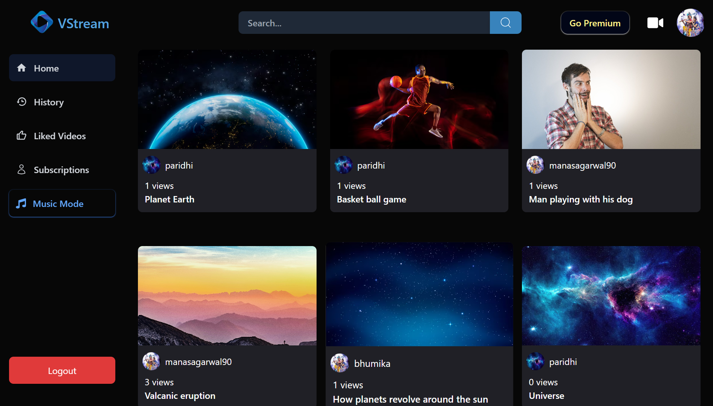
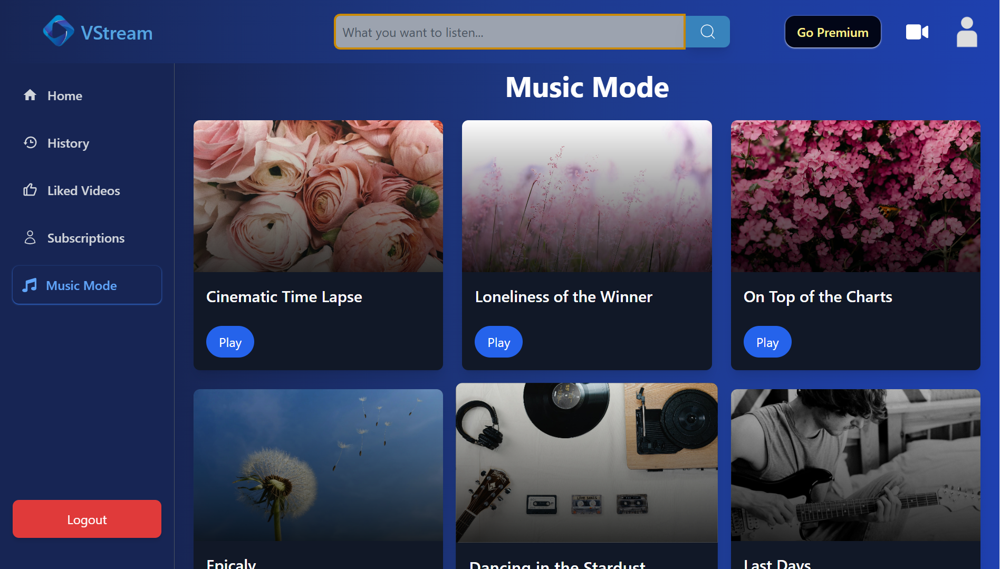
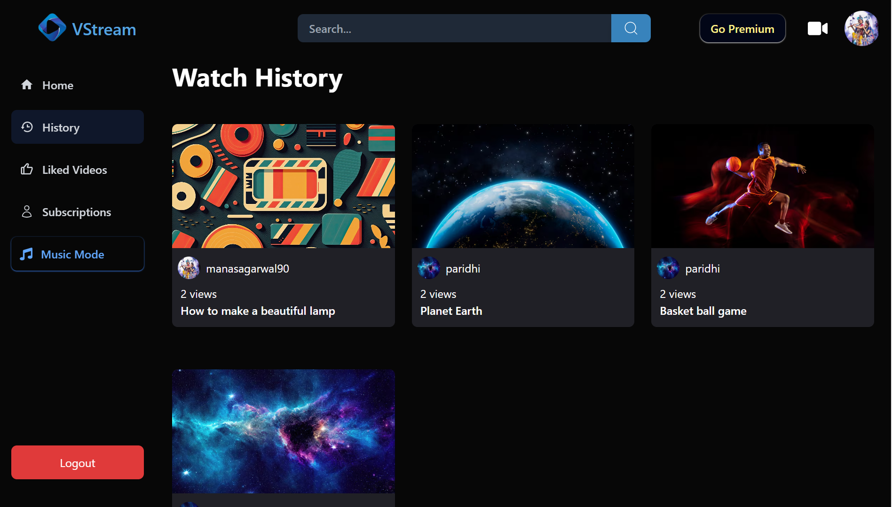
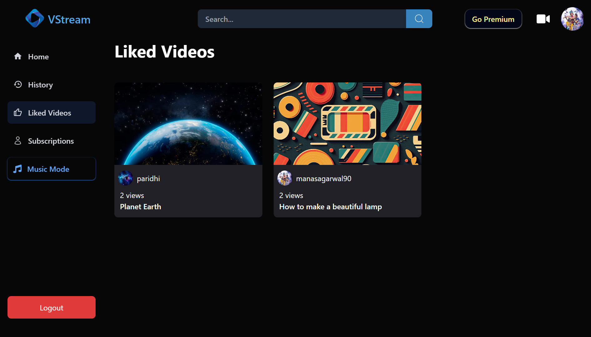
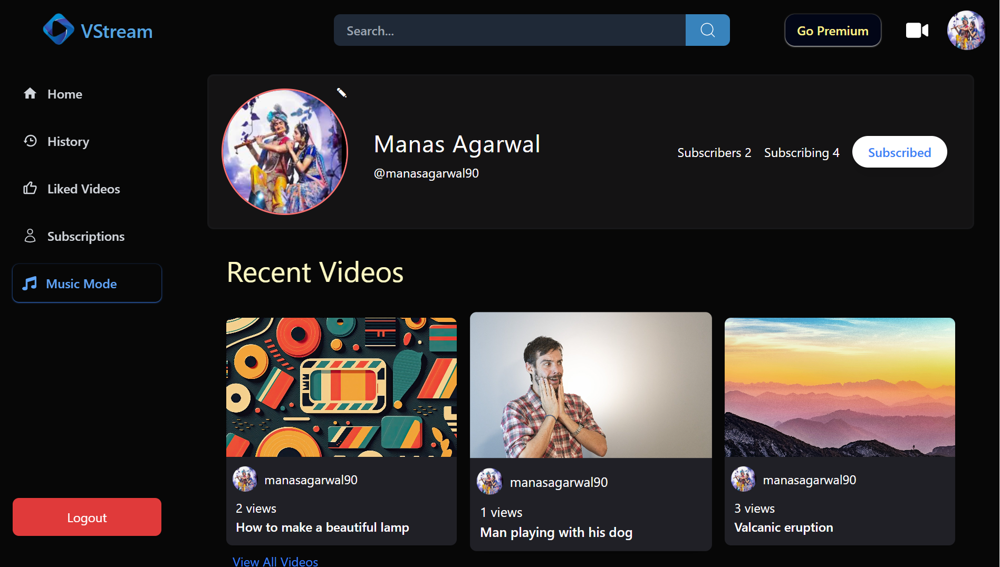
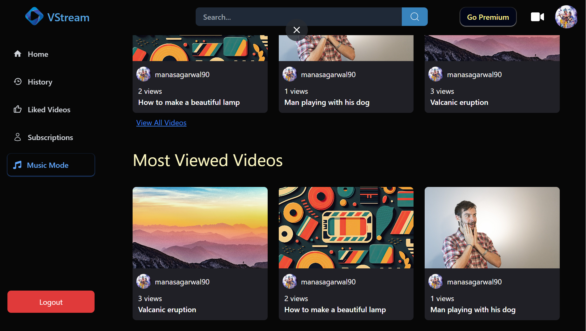
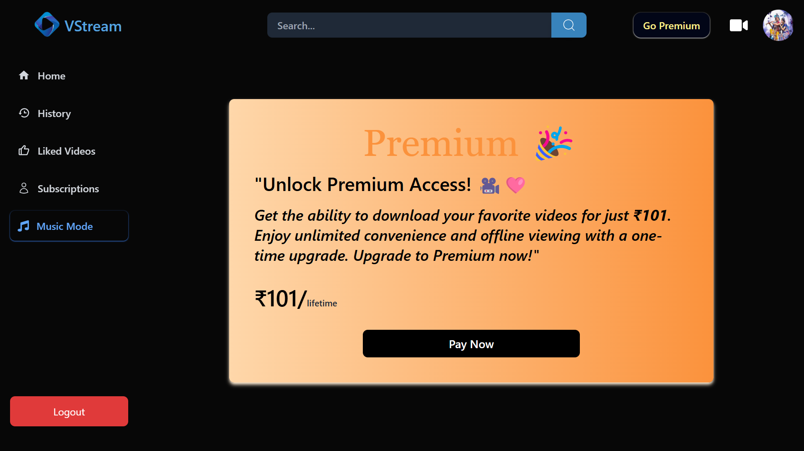

# VStream - A video and music streaming platform

## About VStream
**VStream** is a unified platform for watching videos and listening to music, delivering seamless entertainment in one place.
</br>
</br>
**Website Link** : [https://v-stream-fun.vercel.app/](https://v-stream-fun.vercel.app/)
</br>
</br>
**Backend Repository** : [https://github.com/manas-agarwal16/VStream-backend](https://github.com/manas-agarwal16/VStream-backend)

## Why VStream?
VStream is created to simplify entertainment by bringing videos and music together in one seamless platform. Instead of switching between multiple apps, users can enjoy all their favorite content in one place, ensuring a smooth and uninterrupted experience. Whether for relaxation, inspiration, or discovery, VStream makes entertainment effortless and accessible.

## Tech Stack
<div style="display: flex; flex-wrap: wrap; gap: 20px;">
  &nbsp;&nbsp;&nbsp;
  
  &nbsp;&nbsp;&nbsp;&nbsp;&nbsp;&nbsp;&nbsp;&nbsp;&nbsp;&nbsp;
  
  &nbsp;&nbsp;&nbsp;&nbsp;&nbsp;&nbsp;&nbsp;&nbsp;&nbsp;&nbsp;&nbsp;&nbsp;&nbsp;&nbsp;&nbsp;
  
  &nbsp;&nbsp;&nbsp;&nbsp;&nbsp;&nbsp;&nbsp;
  
  &nbsp;&nbsp;&nbsp;&nbsp;&nbsp;&nbsp;&nbsp;
  
</div>
<div style="display: flex; flex-wrap: wrap; gap: 20px;">
 <pre>ReactJS    Redux-Toolkit    TailwindCSS    NodeJS     MongoDB</pre>
</div>

## Features
1. Video and Music Mode
<p align="center">
<table>
  <tr align="center">
    <td align="center"></td>
    <td align="center"> </td>
  </tr>
</table>
</p>

2. Stores your video history and liked videos
<p align="center">
<table>
  <tr align="center">
    <td align="center"></td>
    <td align="center"></td>
  </tr>
</table>
</p>

3. Your recently and most viewed videos
<p align="center">
<table>
  <tr align="center">
    <td align="center"></td>
    <td align="center"></td>
  </tr>
</table>
</p>

4. Go premium which allows you to download videos
<p align="center">
<table align="center">
  <tr align="center">
    <td align="center"></td>
  </tr>
</table>
</p>
## Installation

To run the application on your localhost, you need to have node installed on your machine. If you don't have it installed, you can follow the instructions [here](https://nodejs.org/en/download) to install it.

1. Clone the repository  
   </br>
   ```sh
   git clone https://github.com/manas-agarwal16/VStream-frontend.git
   ```
2. Navigate to the project directory:  
   </br>
   ```sh
   cd Chess-backend
   ```
3. Install NPM packages  
   </br>
   ```sh
   npm install
   ```
4. Run the Application  
   </br>
   ```js
   npm start
   ```

## Contributing
Contributions to VStream are welcome! If you encounter any issues or have suggestions for improvements, please feel free to open an issue or submit a pull request.

